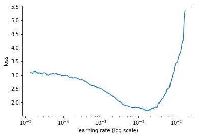
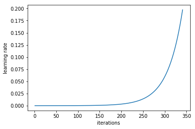
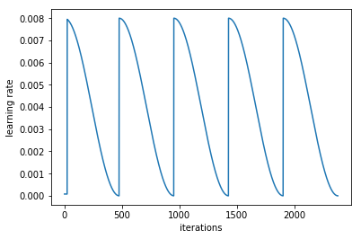
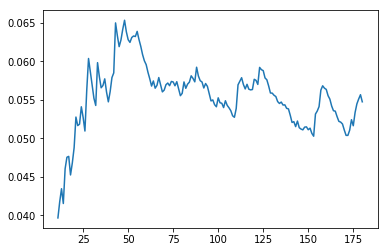

```python
# Put these at the top of every notebook, to get automatic reloading and inline plotting
%reload_ext autoreload
%autoreload 2
%matplotlib inline
```


```python
from fastai.imports import *
```


```python
from fastai.transforms import *
from fastai.conv_learner import *
from fastai.model import *
from fastai.dataset import *
from fastai.sgdr import *
from fastai.plots import *
```


```python
PATH = 'data/plantseeds/'
```


```python
files = !ls {PATH}train/*.png

img = plt.imread(files[random.randint(0,len(files))])
plt.imshow(img);
```


```python
!rm -rf {PATH}tmp
```


```python
sz = 299
arch = resnet101
tfms = tfms_from_model(arch, sz, aug_tfms=transforms_top_down, max_zoom=1.1)
```


```python
!ls {PATH}
```

    labels.csv  result.csv	    test.zip  train.zip
    models	    submission.csv  train     valid


```python
labels_csv = f'{PATH}labels.csv'
n = len(list(open(labels_csv)))-1
val_idxs = get_cv_idxs(n)
```


```python
ls {PATH}valid -1 | wc
```

        794     794   20648


```python
ls {PATH}train -1 | wc
```

       4750    4750  123504


```python
tfms = tfms
bs = 8
data = ImageClassifierData.from_csv(PATH, folder='train', csv_fname=f'{PATH}labels.csv',
                                    tfms=tfms, bs = bs, val_idxs=val_idxs, test_name='valid')
learn = ConvLearner.pretrained(arch, data, precompute=True)
```

    
    100%|██████████| 475/475 [01:20<00:00,  5.87it/s]
    100%|██████████| 119/119 [00:20<00:00,  5.87it/s]
    100%|██████████| 100/100 [00:16<00:00,  5.89it/s]


```python
lrf = learn.lr_find()
```


<p>Failed to display Jupyter Widget of type <code>HBox</code>.</p>
<p>
  If you're reading this message in the Jupyter Notebook or JupyterLab Notebook, it may mean
  that the widgets JavaScript is still loading. If this message persists, it
  likely means that the widgets JavaScript library is either not installed or
  not enabled. See the <a href="https://ipywidgets.readthedocs.io/en/stable/user_install.html">Jupyter
  Widgets Documentation</a> for setup instructions.
</p>
<p>
  If you're reading this message in another frontend (for example, a static
  rendering on GitHub or <a href="https://nbviewer.jupyter.org/">NBViewer</a>),
  it may mean that your frontend doesn't currently support widgets.
</p>


     69%|██████▊   | 326/475 [00:02<00:01, 148.29it/s, loss=7.03]
                                                                 


```python
learn.sched.plot()
```





```python
learn.sched.plot_lr()
```





```python
learn.fit(0.008, 1)
```


<p>Failed to display Jupyter Widget of type <code>HBox</code>.</p>
<p>
  If you're reading this message in the Jupyter Notebook or JupyterLab Notebook, it may mean
  that the widgets JavaScript is still loading. If this message persists, it
  likely means that the widgets JavaScript library is either not installed or
  not enabled. See the <a href="https://ipywidgets.readthedocs.io/en/stable/user_install.html">Jupyter
  Widgets Documentation</a> for setup instructions.
</p>
<p>
  If you're reading this message in another frontend (for example, a static
  rendering on GitHub or <a href="https://nbviewer.jupyter.org/">NBViewer</a>),
  it may mean that your frontend doesn't currently support widgets.
</p>


    [ 0.       1.24462  0.7187   0.7577 ]                        
    


```python
learn.precompute=False
lr = 0.008
learn.fit(lr, 5, cycle_len=1)
```


<p>Failed to display Jupyter Widget of type <code>HBox</code>.</p>
<p>
  If you're reading this message in the Jupyter Notebook or JupyterLab Notebook, it may mean
  that the widgets JavaScript is still loading. If this message persists, it
  likely means that the widgets JavaScript library is either not installed or
  not enabled. See the <a href="https://ipywidgets.readthedocs.io/en/stable/user_install.html">Jupyter
  Widgets Documentation</a> for setup instructions.
</p>
<p>
  If you're reading this message in another frontend (for example, a static
  rendering on GitHub or <a href="https://nbviewer.jupyter.org/">NBViewer</a>),
  it may mean that your frontend doesn't currently support widgets.
</p>


    [ 0.       0.95376  0.4371   0.8624 ]                        
    [ 1.       0.82467  0.38392  0.85819]                        
    [ 2.       0.76206  0.34648  0.87815]                        
    [ 3.       0.65738  0.33106  0.88235]                        
    [ 4.       0.64439  0.33703  0.8813 ]                        
    


```python
learn.sched.plot_lr()
```





```python
lrs = np.array([lr/9,lr/3,lr])
```


```python
learn.unfreeze()
learn.fit(lrs, 3, cycle_len=2, cycle_mult=2)
```


<p>Failed to display Jupyter Widget of type <code>HBox</code>.</p>
<p>
  If you're reading this message in the Jupyter Notebook or JupyterLab Notebook, it may mean
  that the widgets JavaScript is still loading. If this message persists, it
  likely means that the widgets JavaScript library is either not installed or
  not enabled. See the <a href="https://ipywidgets.readthedocs.io/en/stable/user_install.html">Jupyter
  Widgets Documentation</a> for setup instructions.
</p>
<p>
  If you're reading this message in another frontend (for example, a static
  rendering on GitHub or <a href="https://nbviewer.jupyter.org/">NBViewer</a>),
  it may mean that your frontend doesn't currently support widgets.
</p>


      3%|▎         | 13/475 [00:07<04:28,  1.72it/s, loss=1.71]
      3%|▎         | 14/475 [00:08<04:27,  1.72it/s, loss=1.81]

    Exception in thread Thread-18:
    Traceback (most recent call last):
      File "/home/paperspace/anaconda3/envs/fastai/lib/python3.6/threading.py", line 916, in _bootstrap_inner
        self.run()
      File "/home/paperspace/anaconda3/envs/fastai/lib/python3.6/site-packages/tqdm/_tqdm.py", line 144, in run
        for instance in self.tqdm_cls._instances:
      File "/home/paperspace/anaconda3/envs/fastai/lib/python3.6/_weakrefset.py", line 60, in __iter__
        for itemref in self.data:
    RuntimeError: Set changed size during iteration
    


    [ 0.       0.80821  0.46522  0.85049]                        
    [ 1.       0.50003  0.29716  0.90021]                        
    [ 2.       0.55615  0.45812  0.83613]                        
    [ 3.       0.32983  0.2484   0.90966]                        
    [ 4.       0.25339  0.17808  0.93908]                        
    [ 5.       0.21491  0.18781  0.93487]                        
    [ 6.       0.43489  0.33294  0.88726]                        
    [ 7.       0.31849  0.29385  0.89601]                        
    [ 8.       0.29072  0.3111   0.8834 ]                        
    [ 9.       0.16315  0.13599  0.95588]                        
    [ 10.        0.17635   0.1111    0.96113]                    
    [ 11.        0.13042   0.13644   0.95693]                    
    [ 12.        0.11549   0.11833   0.96008]                     
    [ 13.        0.10757   0.13914   0.95273]                     
    


```python
learn.save('newest_model')
```


```python
def get_data(sz):
    tfms = tfms_from_model(arch, sz, aug_tfms=transforms_top_down, max_zoom=1.1)
    return ImageClassifierData.from_csv(PATH, 'train', csv_fname=f'{PATH}labels.csv', tfms=tfms,
                 val_idxs=val_idxs, test_name='valid')
```


```python
sz = 350
learn.set_data(get_data(sz))
learn.freeze()
learn.fit(lr, 3, cycle_len=1, cycle_mult=2)
```


<p>Failed to display Jupyter Widget of type <code>HBox</code>.</p>
<p>
  If you're reading this message in the Jupyter Notebook or JupyterLab Notebook, it may mean
  that the widgets JavaScript is still loading. If this message persists, it
  likely means that the widgets JavaScript library is either not installed or
  not enabled. See the <a href="https://ipywidgets.readthedocs.io/en/stable/user_install.html">Jupyter
  Widgets Documentation</a> for setup instructions.
</p>
<p>
  If you're reading this message in another frontend (for example, a static
  rendering on GitHub or <a href="https://nbviewer.jupyter.org/">NBViewer</a>),
  it may mean that your frontend doesn't currently support widgets.
</p>


    [ 0.       0.05695  0.14037  0.95293]                       
    [ 1.       0.05341  0.13508  0.95293]                       
    [ 2.       0.05208  0.1403   0.94668]                       
    [ 3.       0.04661  0.13777  0.95085]                       
    [ 4.       0.04742  0.1334   0.94981]                       
    [ 5.       0.04757  0.13408  0.95189]                       
    [ 6.       0.04829  0.14456  0.94772]                       
    


```python
sz = 256
learn.set_data(get_data(sz))
learn.freeze()
learn.fit(lr/10, 3, cycle_len=1, cycle_mult=1)
```


<p>Failed to display Jupyter Widget of type <code>HBox</code>.</p>
<p>
  If you're reading this message in the Jupyter Notebook or JupyterLab Notebook, it may mean
  that the widgets JavaScript is still loading. If this message persists, it
  likely means that the widgets JavaScript library is either not installed or
  not enabled. See the <a href="https://ipywidgets.readthedocs.io/en/stable/user_install.html">Jupyter
  Widgets Documentation</a> for setup instructions.
</p>
<p>
  If you're reading this message in another frontend (for example, a static
  rendering on GitHub or <a href="https://nbviewer.jupyter.org/">NBViewer</a>),
  it may mean that your frontend doesn't currently support widgets.
</p>


    [ 0.       0.05958  0.16808  0.94649]                       
    [ 1.       0.05767  0.17035  0.94734]                       
    [ 2.       0.05475  0.16668  0.94525]                       
    


```python
log_preds_test, y = learn.TTA(is_test=True)
```

                                                 


```python
log_preds_test = np.mean(np.exp(log_preds_test),0)
log_preds_test.shape
```


    (794, 12)


```python
# log_preds_test = np.argmax(log_preds_test, axis=1)
# preds_classes = [data.classes[i].replace("_", " ") for i in log_preds_test]
submission = pd.DataFrame({'file': os.listdir(f'{PATH}valid'), 'species': preds_classes})
submission.to_csv('data/plantseeds/submission.csv', index=False)
```


```python

```





```python
learn.save('newest_model')
```


```python
sz = 299
learn.set_data(get_data(sz))
learn.freeze()
learn.fit(lr/100, 3, cycle_len=1, cycle_mult=2)
```


<p>Failed to display Jupyter Widget of type <code>HBox</code>.</p>
<p>
  If you're reading this message in the Jupyter Notebook or JupyterLab Notebook, it may mean
  that the widgets JavaScript is still loading. If this message persists, it
  likely means that the widgets JavaScript library is either not installed or
  not enabled. See the <a href="https://ipywidgets.readthedocs.io/en/stable/user_install.html">Jupyter
  Widgets Documentation</a> for setup instructions.
</p>
<p>
  If you're reading this message in another frontend (for example, a static
  rendering on GitHub or <a href="https://nbviewer.jupyter.org/">NBViewer</a>),
  it may mean that your frontend doesn't currently support widgets.
</p>


    [ 0.       0.04592  0.13721  0.95463]                       
    [ 1.       0.04689  0.12788  0.95691]                       
    [ 2.       0.04661  0.13413  0.95463]                       
    [ 3.       0.0469   0.12313  0.95899]                       
    [ 4.       0.04625  0.13134  0.95567]                       
    [ 5.       0.0471   0.13658  0.95463]                       
    [ 6.       0.04834  0.13594  0.95463]                       
    


```python
log_preds_test, y = learn.TTA(is_test=True)
log_preds_test = np.mean(np.exp(log_preds_test),0)
log_preds_test = np.argmax(log_preds_test, axis=1)
preds_classes = [data.classes[i].replace("_", " ") for i in log_preds_test]
submission = pd.DataFrame({'file': os.listdir(f'{PATH}valid'), 'species': preds_classes})
submission.to_csv('data/plantseeds/submission.csv', index=False)
```

                                                 


```python
learn.save('74_model')
```
